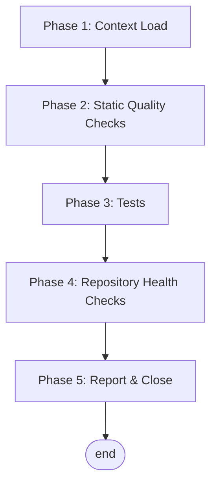

# Housekeeping Workflow — recommender_epistemic_diversity

Per-repository housekeeping routine for this paper-replication project. The repo holds a Python implementation of a two-armed bandit model (`model/`), pytest tests (`tests/`), Jupyter notebooks (`experiments/`), and a LaTeX paper (`latex/`). Run this workflow periodically or after any significant batch of changes.

**Execution model:** sequential — each phase has an explicit exit criterion and a remediation step.

**Prerequisites:**
- Python environment with `requirements.txt` installed (`numpy`, `scipy`, `matplotlib`, `jupyterlab`, `pytest`, `tqdm`).
- LaTeX toolchain (`lualatex` + `biber`) if exercising the paper build (Phase 4 § build smoke).
- A `worklog.jsonl` and `TODO_WORKFLOW.md` at the repo root for capturing significant agent sessions and deferred work. See `## JSONL Logs` below for the `worklog.jsonl` schema and the inline append pattern.

---

## Flow



---

## JSONL Logs

This workflow's archive (Phase 5 Step 2) lives at `housekeeping_log.jsonl` at the repo root — append-only, one JSON record per line, oldest-first (newest at the end). Every line must parse independently as JSON. No script wraps the file: entries are constructed and appended inline. The schema below is the **canonical contract**.

**A related per-repo JSONL log — `worklog.jsonl`** — is written at session-wrap-up, not during housekeeping. Its schema and append protocol are documented in `TODO_WORKFLOW.md` § Worklog (canonical source for this repo).

### Record schema — `housekeeping_log.jsonl` (`schema_version: 1`)

```json
{
  "schema_version": 1,
  "entry_id":       "YYYY-MM-DD",
  "date":           "YYYY-MM-DD",
  "trigger":        "One-line context — what triggered the run",
  "metrics":        { "format": "n/a", "lint": "n/a", "tests": { "passed": 18, "failed": 0, "skipped": 0 } },
  "body_markdown":  "### Notable\n\n...\n\n### Outstanding\n\n- ..."
}
```

| Field | Type | Notes |
|:--|:--|:--|
| `schema_version` | int | Currently `1`. Bump on breaking changes. |
| `entry_id` | string | Unique within the file. Default `YYYY-MM-DD`; same-day collisions append `-b` / `-c` / `-d` in order. |
| `date` | string | ISO `YYYY-MM-DD` — the run date. |
| `trigger` | string | One-line context pulled from the Latest Report's `**Trigger:**` line. |
| `metrics` | object | Free-form dict — the same shape as the YAML block in the Latest Report Template at the bottom of this file. |
| `body_markdown` | string | Any `### Notable` / `### Outstanding` prose from the run, as one opaque markdown blob. Empty string when the run was clean and had nothing to add. Newlines escape as `\n`. |

### Append an entry (inline pattern — no script needed)

```bash
python3 - <<'PY' >> housekeeping_log.jsonl
import json
rec = {
    "schema_version": 1,
    "entry_id":       "2026-05-28",
    "date":           "2026-05-28",
    "trigger":        "Routine housekeeping cadence",
    "metrics":        {"format": "n/a", "lint": "n/a", "tests": {"passed": 18, "failed": 0, "skipped": 0}},
    "body_markdown":  "",
}
print(json.dumps(rec, ensure_ascii=False))
PY
```

Before appending, check existing entries for an `entry_id` collision and pick the next free `-b` / `-c` / `-d` suffix if today's run isn't the first of the day:

```bash
jq -r --arg today "2026-05-28" '.entry_id | select(startswith($today))' housekeeping_log.jsonl
```

### Human review (render via `jq`)

```bash
jq -r '"## \(.entry_id)\n\n**Trigger:** \(.trigger)\n\n\(.body_markdown // "")\n"' housekeeping_log.jsonl | tail -200
```

---

## Phase 1 — Context Load

**Goal:** Identify the stack, tooling, and conventions of this repository before running any check.

### Step 1 — Discover the toolchain

1. Read [README.md](README.md) for documented test/build/lint commands.
2. Inspect [requirements.txt](requirements.txt) for the active dependency pins.
3. Note that this repo does not (yet) ship a formatter, linter, or type checker. Those Phase 2 steps fall back to `n/a` until configured — see § Outstanding below if introducing them is in scope.

### Step 2 — Read the prior baseline

Read the "Latest Report" section at the bottom of this file. Note the previous test pass count, warning count, and any unresolved follow-ups. These are the comparison points for this run.

**Exit criterion:** Toolchain commands recorded; prior baseline loaded.

---

## Phase 2 — Static Quality Checks

**Goal:** Verify the codebase is clean before exercising it.

### Step 1 — Format check

```bash
# Not configured. To adopt: pip install black && black --check model/ tests/
# Record as `n/a` until configured.
```

### Step 2 — Lint

```bash
# Not configured. To adopt: pip install ruff && ruff check model/ tests/
# Record as `n/a` until configured.
```

### Step 3 — Type check

```bash
# Not configured. To adopt: pip install mypy && mypy model/
# Record as `n/a` until configured.
```

### Step 4 — Remediation

Apply fixes in this order:
- **Format errors:** run the formatter without `--check` and re-verify.
- **Lint errors:** fix in source. Do not silence with inline disables unless the disable is documented and justified in the same change.
- **Type errors:** fix in source. Never widen with `Any` to bypass — that hides real bugs.

**Exit criterion:** All configured static checks return zero errors; unconfigured ones recorded as `n/a`.

---

## Phase 3 — Tests

**Goal:** Verify behavior is unbroken and the test suite has not silently shrunk.

### Step 1 — Unit tests

```bash
pytest tests/
```

The current baseline is **18 tests, all passing** (per the README): bandit input validation, conjugate Beta updates, myopic-Bayesian choice, three discovery definitions, simulation reproducibility under a fixed seed, and a long-run "concentrates on the better arm" sanity check.

### Step 2 — Integration / end-to-end tests

`n/a` — no separate integration suite. The notebook in [experiments/](experiments/) acts as a manual end-to-end exercise; record any notebook-run issues under § Notable.

### Step 3 — Test count comparison

Compare pass / fail / skipped counts against the prior "Latest Report." Any regression — newly failing tests, suddenly skipped tests, a reduced total without an explanation — is a finding to investigate before closing the run.

**Exit criterion:** All tests pass; test count is steady or higher than the prior report (or any drop has a documented justification).

---

## Phase 4 — Repository Health Checks

**Goal:** Catch slow-burning issues that lint and tests do not surface.

### Step 1 — Dependency drift

```bash
pip list --outdated
# Optional: pip install pip-audit && pip-audit
```

Verify: no unaddressed vulnerability advisories; no pins clearly behind upstream.

### Step 2 — Dead code / unused exports

```bash
# Not configured. To adopt: pip install vulture && vulture model/ tests/
# Record as `n/a` until configured.
```

### Step 3 — Build smoke

```bash
# Notebook smoke (lightweight — just imports model):
python -c "from model import bandit, agent, recommender, discovery, simulation; print('imports ok')"

# Paper PDF build (heavier — runs lualatex + biber):
cd latex && latexmk
```

A green test suite with a broken notebook import path or a broken paper build means a regression — investigate before closing.

### Step 4 — Documentation freshness

- Does [README.md](README.md) still describe the actual run / test / build commands?
- Are there stale references to old PDFs (`recommenders.pdf` was retired 2026-05-28) or to a folder name that no longer exists?
- Are there `worklog.jsonl` / `TODO_WORKFLOW.md` entries that reference resolved work and should now be cleaned up?

### Step 5 — Blast-radius graph artifacts

`n/a` — this repo has no graph artifacts yet. Skip unless the project adopts the blast-radius skill.

**Exit criterion:** No surprising drift. Anything actionable that is out of scope for this run is filed in `TODO_WORKFLOW.md` with a reproduction step, not left only in this report.

---

## Phase 5 — Report & Close

**Goal:** Leave an auditable trail so the next housekeeping run has a baseline to compare against, without letting this file grow unboundedly.

### Step 1 — Append a new "Latest Report"

Replace the prior `## Latest Report` block with a new one using the compact-metrics shape at the bottom of this file. A clean run is ~15 lines; add `### Notable` / `### Outstanding` sections only when the run surfaced something worth reading.

### Step 2 — Archive the prior Latest Report

Append the previous `## Latest Report` block to `housekeeping_log.jsonl` per the schema and inline pattern documented in § JSONL Logs above. The `**Trigger:**` line becomes `trigger`; the YAML metrics block becomes `metrics`; any `### Notable` / `### Outstanding` prose becomes `body_markdown`; the run date becomes `date` and (after collision suffixing) `entry_id`.

### Step 3 — File follow-ups

If anything was found and not fixed, file it in `TODO_WORKFLOW.md` with enough context for a fresh agent to pick it up. Findings must not live only in this report.

### Step 4 — Bump `last_checked`

Update the `last_checked` field in this file's metadata header to today's date.

**Exit criterion:** New compact-shape Latest Report appended; prior Latest Report archived; deferred work recorded in `TODO_WORKFLOW.md`; tests / build green or have explicit known-issue annotations.

---

## Quick Reference — Housekeeping Checklist

```text
[ ] Phase 1: Toolchain identified, prior baseline read
[ ] Phase 2: Format / lint / type checks — clean (or `n/a`)
[ ] Phase 3: pytest — green; counts steady or improving
[ ] Phase 4: Dependency / dead-code / build / docs — no surprising drift
[ ] Phase 5: New compact-shape Latest Report appended; prior Latest Report archived to housekeeping_log.jsonl; deferrals filed in TODO_WORKFLOW.md; `last_checked` bumped
```

---

## Latest Report

**Date:** 2026-05-28
**Trigger:** Initial scaffold — no prior baseline; bootstrapping HOUSEKEEPING.md from the KB template.

```yaml
format:        n/a   # no formatter configured
lint:          n/a   # no linter configured
types:         n/a   # no type checker configured
tests:         { passed: 18, failed: 0, skipped: 0 }   # claimed by README; not re-run in this scaffold pass
integration:   n/a
dependencies:  not checked
dead_code:     n/a
build:         not checked
docs:          ok    # README updated 2026-05-28 to reflect repo reality
```

### Notable

Repo setup pass: added `.gitignore`, untracked previously-committed `latex/build/` and `__pycache__` directories, removed orphan `recommenders.pdf` (root + `latex/`), bootstrapped `TODO_WORKFLOW.md`, `worklog.jsonl`, `HOUSEKEEPING.md`, `housekeeping_log.jsonl`, and a project `CLAUDE.md`. README structure block updated to match actual filenames and folder name.

### Outstanding

- Decide whether to adopt a formatter (`black`), linter (`ruff`), and type checker (`mypy`). If yes, file a `TODO_WORKFLOW.md` task to wire them and update Phase 2 of this file.
- Run a real housekeeping pass (pytest + paper build) on next session to replace `not checked` entries with real metrics.
